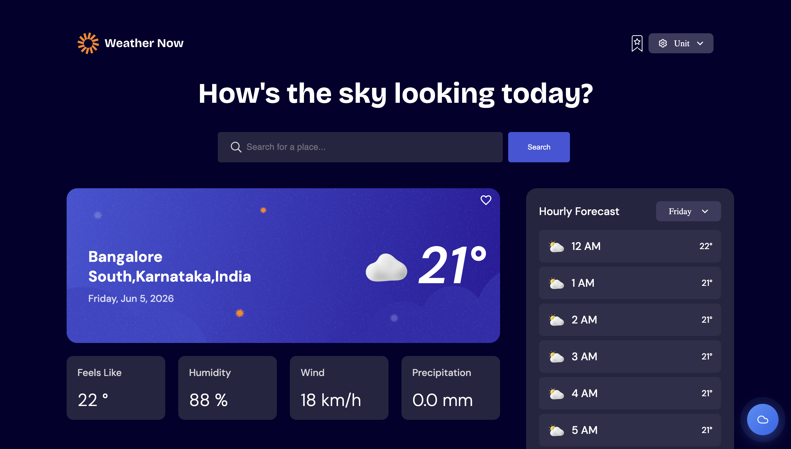

# Weather App

A responsive weather dashboard built with React and Vite. Search for locations, view current weather, daily and hourly forecasts, save favorite cities, and interact with an AI-powered weather assistant.



## Features

- **Location search** with autocomplete suggestions.
- **Current weather summary** with temperature, weather condition, and location details.
- **Additional metrics** including feels like temperature, humidity, wind speed, and precipitation.
- **7-day daily forecast** with high/low temperatures and weather icons.
- **Hourly forecast** showing temperature changes through the day.
- **Unit toggle** between Metric and Imperial systems.
- **Saved locations** persisted in local storage for quick access.
- **Geolocation support** to load weather for the user's current location.
- **Weather assistant chat widget** for natural language weather queries and suggestions.
- **Responsive design** optimized for desktop and mobile.

## Technologies Used

- React 19
- Python
- Vite
- Redux Toolkit
- Axios
- Open-Meteo API
- LocationIQ reverse geocoding
- FastAPI backend service
- Google Gemini agent integration
- MUI icons and Emotion styling utilities

## Backend Service

The app includes a backend powered by FastAPI that handles the AI weather assistant chat flow.
It uses Google Gemini for agent orchestration and Open-Meteo tools for real weather and forecast data.
The backend exposes endpoints for streaming chat responses and session history management.

## Installation

1. Clone the repository:

   ```bash
   git clone https://github.com/yourusername/weather-app.git
   ```

2. Navigate to the project directory:

   ```bash
   cd weather-app
   ```

3. Install frontend dependencies:

   ```bash
   npm install
   ```

4. Create a `.env` file in the project root and add your LocationIQ API key:

   ```bash
   VITE_LOCATIONIQ_API_KEY=your_locationiq_api_key
   ```

5. Install backend dependencies and configure the backend API key:

   ```bash
   cd backend
   python3 -m venv .venv
   source .venv/bin/activate
   pip install -r requirements.txt
   ```

   Then add the Gemini API key to the same project root `.env` file:

   ```bash
   WEATHER_APP_GEMINI_API_KEY=your_google_gemini_api_key
   ```

6. Start the backend server:

   ```bash
   uvicorn main:app --reload --host 0.0.0.0 --port 8000
   ```

7. Start the frontend development server from the project root:

   ```bash
   npm run dev
   ```

> If you want the frontend to use a local backend instead of the hosted public API, update the `API` constant in `src/hooks/useWeatherAgent.js`.

## Usage

- Search for a city or place name to load weather data.
- Switch temperature units using the unit selector.
- Save and revisit favorite locations with the saved locations panel.
- Use the weather assistant chat widget for quick weather insights.

## Build

To create a production build:

```bash
npm run build
```

To preview the production build locally:

```bash
npm run preview
```

## Author

- **Komal Rout**
- GitHub: [komalrout](https://github.com/KomalRout)
- Frontend Mentor: [@komalrout](https://www.frontendmentor.io/profile/KomalRout)

## Acknowledgments

Special thanks to the Frontend Mentor community for their support.
